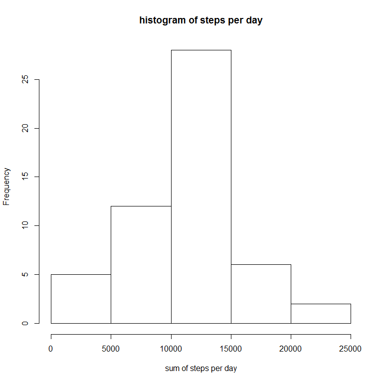
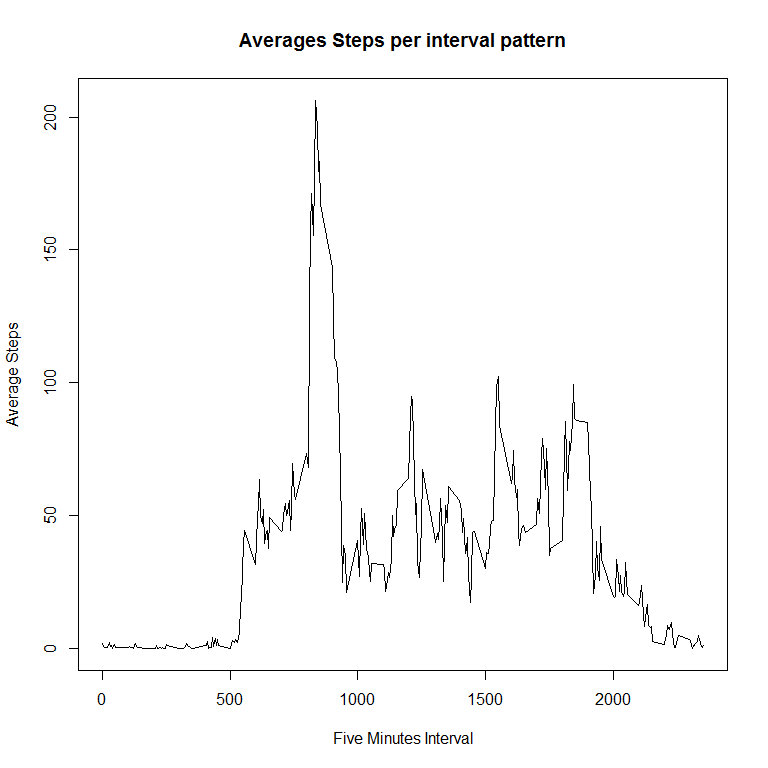
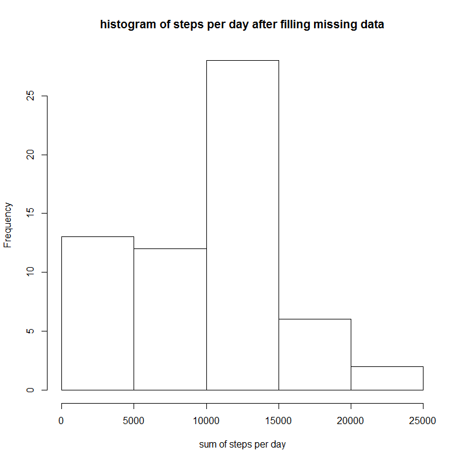
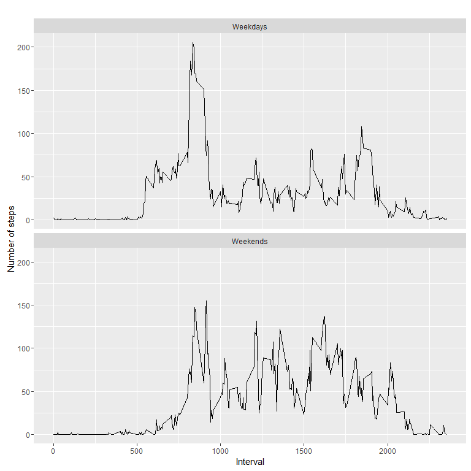

# Reproducible Research: Peer Assessment 1


## Loading and preprocessing the data

```r
library(chron)
```

```
## Warning: package 'chron' was built under R version 3.3.1
```

```r
library(ggplot2)
library(dplyr)
```

```
## Warning: package 'dplyr' was built under R version 3.3.1
```

```
## 
## Attaching package: 'dplyr'
```

```
## The following objects are masked from 'package:stats':
## 
##     filter, lag
```

```
## The following objects are masked from 'package:base':
## 
##     intersect, setdiff, setequal, union
```

```r
datafileName <- "activity.zip"

 if(!file.exists("activity.csv")){
        res <- tryCatch(unzip(datafileName, 
                              files = NULL, 
                              list = FALSE, 
                              overwrite = TRUE,
            junkpaths = FALSE, exdir = ".", unzip = "internal",
            setTimes = FALSE), 
            error=function(e) 1)
    }

activityDataframe <- read.csv("activity.csv")
```

## What is mean total number of steps taken per day?
Calculate the total number of steps taken per day

```r
sum_steps_per_day <- aggregate(steps~date, 
                                data=activityDataframe,
                                FUN=sum, na.rm=TRUE)
```

The means are graphically represented in the below histogram


```r
plot.new()
hist(sum_steps_per_day$steps, xlab = "sum of steps per day", main = "histogram of steps per day")
```

<!-- -->

Calculate and report the mean and median of the total number of steps taken per day
*Calculating the mean and median*

```r
mean_sum_steps_each_day <- mean(sum_steps_per_day$steps)
print(
    paste("The Mean of steps per day is: ", 
          mean_sum_steps_each_day, 
          sep = " ")
    )
```

```
## [1] "The Mean of steps per day is:  10766.1886792453"
```

```r
median_sum_steps_each_day <- median(sum_steps_per_day$steps)
print(paste("The Median of steps per day is: ", median_sum_steps_each_day, sep = " "))
```

```
## [1] "The Median of steps per day is:  10765"
```

## What is the average daily activity pattern?
Time series plot (i.e. type = "l") of the 5-minute interval (x-axis) and the average number of steps taken, averaged across all days (y-axis)

*Creating a dataframe with the mean of each 5-minute interval*

```r
mean_steps_interval <- aggregate(steps~interval, 
                                 data = activityDataframe,
                                 FUN=mean, 
                                 na.rm =TRUE)
```
*Generating the plot diagram*

```r
plot.new()
plot(x = mean_steps_interval$interval,
     y = mean_steps_interval$steps, 
     type = "l",
     xlab = "Five Minutes Interval",
     ylab = "Average Steps", 
     main = "Averages Steps per interval pattern" ) 
```

<!-- -->

**The 5-minute interval, on average across all the days in the dataset, contains the maximum number of steps**


```r
max_steps <- max(mean_steps_interval$steps)
max_steps_interval <- filter(mean_steps_interval,
                             steps == max_steps)
print(
     paste("Maximum Steps are ",
           max_steps_interval[1,2][1], 
           sep = " ")
     )
```

```
## [1] "Maximum Steps are  206.169811320755"
```

```r
print(
     paste("Maximum Interval is ",
           max_steps_interval[1,1][1], 
           sep = " ")
     )
```

```
## [1] "Maximum Interval is  835"
```

## Imputing missing values
the total number of missing values in the dataset

```r
missing_values <- nrow(filter(activityDataframe, is.na(steps) == TRUE ))
print(
    paste("The number of missing values is:", 
          missing_values, 
          sep = " ")
)
```

```
## [1] "The number of missing values is: 2304"
```
**Strategy for filling in all of the missing values in the dataset**
*Use the median of the inteval*
 

```r
Filled_activity_DataFrame = activityDataframe
median_steps_interval <- aggregate(steps~interval, 
                                 data = activityDataframe,
                                 FUN=median, 
                                 na.rm =TRUE)

colnames(median_steps_interval)[1] <- "MedianInterval"

for (i in 1:nrow(Filled_activity_DataFrame)){
    
    if(is.na(Filled_activity_DataFrame$steps[i])){
        
        Filled_activity_DataFrame$steps[i]<- 
            filter(median_steps_interval, 
                   MedianInterval==
                       Filled_activity_DataFrame$interval[i])[,2]
    }
}
```

*recalculating the number of missing values*

```r
missing_values <- nrow(filter(Filled_activity_DataFrame, 
                              is.na(steps) == TRUE ))
print(
    paste("The number of missing values is:", 
          missing_values, 
          sep = " ")
)
```

```
## [1] "The number of missing values is: 0"
```
**A histogram of the total number of steps taken each day in the filled data frame**
*calculating the new total steps per day*

```r
filled_sum_steps_per_day <- aggregate(steps~date, 
                                data=Filled_activity_DataFrame,
                                FUN=sum, na.rm=TRUE)
```
*Creating new histogram*

```r
plot.new()
hist(filled_sum_steps_per_day$steps, 
     xlab = "sum of steps per day", 
     main = "histogram of steps per day after filling missing data")
```

<!-- -->

**Calculate and report the mean and median total number of steps taken per day**

*Calculating the mean and median*

```r
mean_sum_filled_steps_each_day <-
    mean(filled_sum_steps_per_day$steps)

print(
    paste("The Mean of steps per day after filling missing data is: ", 
          mean_sum_filled_steps_each_day, 
          sep = " ")
    )
```

```
## [1] "The Mean of steps per day after filling missing data is:  9503.86885245902"
```

```r
median_sum_filled_steps_each_day <-
    median(filled_sum_steps_per_day$steps)

print(paste("The Median of steps per day after filling missing data is: ",
            median_sum_filled_steps_each_day, sep = " "))
```

```
## [1] "The Median of steps per day after filling missing data is:  10395"
```

**Notice: that the mean has decreased and the median has increased**

## Are there differences in activity patterns between weekdays and weekends?
**Creating a new factor variable in the dataset with two levels - "weekday" and "weekend" indicating whether a given date is a weekday or weekend day**

*Preparing day class column and aggregating data*

```r
Filled_activity_DataFrame$dayClass <- c("type_of_day")


for(i in 1:nrow(Filled_activity_DataFrame))
{
    if(is.weekend(Filled_activity_DataFrame$date[i])){
    Filled_activity_DataFrame$type_of_day[i] <- "Weekends"
    }
    else{
        Filled_activity_DataFrame$type_of_day[i] <- "Weekdays"
    }
      
}
Filled_activity_DataFrame$type_of_day =
    as.factor(Filled_activity_DataFrame$type_of_day)

day_type_mean_data <- aggregate(steps ~ interval + type_of_day, Filled_activity_DataFrame, mean)
```

*Generating the time series*

```r
qplot(interval, 
      steps, 
      data = day_type_mean_data, 
      geom=c("line"),
      xlab = "Interval", 
      ylab = "Number of steps", 
      main = "") +
  facet_wrap(~ type_of_day, ncol = 1)
```

<!-- -->

